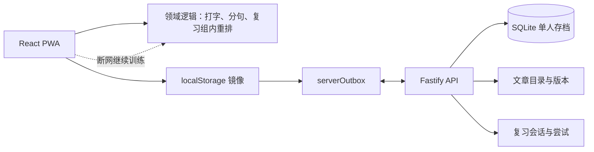
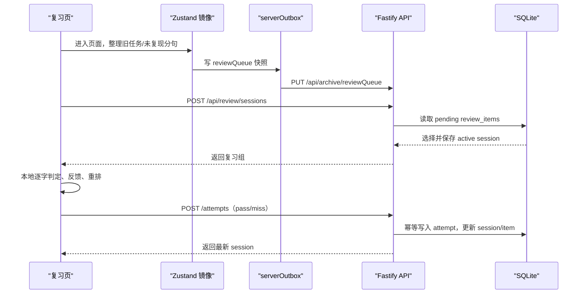

# 文言文背诵系统架构

> 版本：v2.0 · 更新日期：2026-08-10

本项目是单人使用的学习应用：没有登录、没有用户表、没有权限系统，只有一份本机存档。后端的作用是把这份存档从浏览器临时状态提升为可靠的业务存档，并让复习会话在刷新后可以恢复。

## 1. 架构原则

1. **单存档**：SQLite 中只有一份学习存档，不引入身份校验。
2. **服务端权威**：文章目录、学习进度、错点、复习项和复习会话以 API/SQLite 为最终来源。
3. **本地优先交互**：每个字的判定、反馈、动画和组内重排在前端完成，不等待网络。
4. **可离线降级**：浏览器继续保留各命名空间的本地缓存和待同步 outbox；后端暂时不可用时仍可训练。
5. **模块化单体**：当前规模使用一个 Fastify 服务和 SQLite；只有出现独立扩展压力时才拆服务。

## 2. 系统结构

```text
wenyan/
├─ src/                         React PWA
│  ├─ api/
│  │  ├─ archive.ts             启动导入、服务端存档恢复
│  │  ├─ review.ts              复习会话 API
│  │  └─ syncQueue.ts           命名空间 outbox 和后台同步
│  ├─ domain/                   纯训练/复习逻辑
│  ├─ stores/                   Zustand 本地镜像
│  └─ pages/
├─ server/
│  ├─ index.ts                 启动 API
│  ├─ app.ts                   Fastify 路由和静态文件
│  ├─ db.ts                    SQLite 迁移、快照和结构化投影
│  └─ types.ts                 服务端契约
└─ data/wenyan.sqlite          单人存档（运行时生成，不提交代码库）
```

运行时关系：



## 3. 后端模块

### 3.1 存档模块

接口：

```text
GET  /api/archive
POST /api/archive/import
PUT  /api/archive/:namespace
GET  /api/health
```

命名空间与前端保持一致：`learning`、`progress`、`mistakes`、`reviewQueue`、`badges`、`attempts`。存档使用：

```ts
interface StoredRoot {
  schemaVersion: number
  data: unknown
}
```

首次启动流程：

1. 前端请求 `/api/archive`。
2. SQLite 没有初始化标记时，前端已有浏览器数据通过 `/api/archive/import` 导入。
3. 已初始化时，先上传本地 outbox，再用服务端快照覆盖本地镜像。
4. 服务端不可用时跳过等待，继续使用浏览器存档。

快照用于版本迁移和无损恢复；服务端同时维护结构化投影表：

- `learning_entries`
- `learning_progress`
- `mistake_records`
- `exam_attempts`
- `review_items`
- `review_sessions`
- `review_attempts`
- `badge_state`

### 3.2 内容模块

```text
GET /api/content/passages
```

服务启动时把内置篇目写入 `content_passages`。在线篇目在 `learning` 命名空间导入后也进入此表。文章的 `contentVersion` 和句子/分句稳定 ID 是进度绑定依据；服务端发布的目录会在前端启动时替换构建期目录。

### 3.3 复习模块

```text
POST /api/review/sessions
GET  /api/review/sessions/active
POST /api/review/sessions/:sessionId/attempts
POST /api/review/sessions/:sessionId/complete
```

服务端从 `review_items.status = 'pending'` 中按共享优先级选择最多 10 个句对或约 150 个汉字，创建一个 `review_session`。同一时间只允许一组 active 会话，因此刷新/返回后会恢复原组，而不是重新抽题。

前端负责：

- 前分句/篇名提示；
- 实时首字母输入和错误反馈；
- 答错后延迟展示完整后句；
- 组内隔两题回插及连续两次无错规则。

每个结果提交一次 `review_attempt`。`operationId` 唯一，重复请求只返回已处理结果，不重复累计。

## 4. 前端数据流



训练页不上传逐字按键，只在训练单元、Boss attempt 或复习句对完成/出错时写入摘要。高频 UI 状态不会进入 SQLite。

## 5. 重要数据归属

| 数据 | 权威来源 | 前端用途 |
|---|---|---|
| 文章和内容版本 | `content_passages` | 页面展示和离线缓存 |
| 学习进度 | `learning_progress` | 即时渲染和安全检查点 |
| 错点 | `mistake_records` | 错题展示、复习候选 |
| 复习项 | `review_items` | 首页红点、本地候选镜像 |
| 复习组 | `review_sessions` | 刷新恢复当前组 |
| 复习结果 | `review_attempts` | 幂等审计和状态折叠 |

复习组的临时顺序不作为全局队列保存；服务端保存当前会话，完成后才从 pending 候选中创建下一组。

## 6. 开发与部署

```text
npm run dev       # Fastify :8787 + Vite :5173
npm test          # 前端、领域和服务端测试
npm run build     # 前端和服务端类型检查 + PWA 构建
npm start         # Fastify API，同时托管已构建的 dist
```

开发环境 Vite 将 `/api` 代理到 `127.0.0.1:8787`。SQLite 路径默认为 `data/wenyan.sqlite`，可用 `WENYAN_DB_PATH` 覆盖。该文件属于个人存档，必须加入忽略列表，不提交到代码库。

## 7. 明确不做的内容

- 不做登录、匿名设备表、权限和多租户字段。
- 不做跨设备合并；只有一份存档，导入时以服务端存档为准。
- 不把逐字输入上传到后端。
- 当前不拆微服务，不引入 Redis、消息队列或云端分析仓库。
